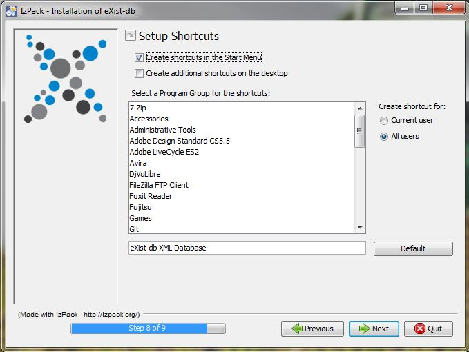

# eXist-db Installation

Um an *quoteSalute* arbeiten zu können, muss zunächst eXist-db und dann die quoteSalute.DB App installiert werden. In diese Anleitung sind alle notwendigen Schritte beschrieben.

## Systemvoraussetzungen

eXist-db läuft mit Java und funktioniert somit auf allen aktuellen Linux, macOS und Windows Betriebsystemen. Folgende Voraussetzungen sind erforderlich:

* mindestens Java 8 (Installations-Anleitungen finden Sie hier: [Java-Downloads für alle Betriebssysteme](https://www.java.com/de/download/manual.jsp))
* ca. 200Mb Festplattenkapazität
* ca. 512Mb Arbeitsspeicher

Für einige Schritte sind administrative Rechte erforderlich.

Hinweis: Prüfen Sie vorab, ob Java 8 installiert ist und andere/ältere Versionen von eXist-db vollständig deinstalliert sind.

## Installation

1. Gehen Sie auf [Homepage von eXist-db](http://exist-db.org/exist/apps/homepage/index.html) und klicken Sie auf "Download eXist-db".
2. Es wird eine .jar-Datei heruntergeladen mit dem Namen `eXist-db-setup-[version].jar` (z.B. `eXist-db-setup-4.6.1.jar`).
3. Gehen Sie in den Downloadordner und führen Sie die .jar-Datei aus:
    * bei Windows und Mac doppelt klicken
    * bei Linux rechtsklick und dann auf "mit Java ausführen" klicken
    * oder über die Kommandozeile:
    ```java -jar eXist-db-setup-[version].jar```
4. Nun öffnet sich ein Installationsassitent. Wir empfehlen die Standardeinstellungen beizubehalten. Klicken Sie auf "Next". 
5. Sie werden nach folgenden Schritten gefragt:
    1. Installationsordner: wählen Sie einen Pfad und klicken Sie auf "Next".  
    2. Datenordner wählen Sie einen Pfad und klicken Sie auf "Next". 
    3. Admin Passwort und Memory Einstellungen:
        * geben Sie hier ein Passwort Ihrer Wahl ein. Dieses wird später bei bestimmten Aktionen in eXist-db benötigt.
        * Hinweis: das Freilassen stellt ein Sicherheitsrisiko dar und ist deshalb nicht zu empfehlen.
        
    4. Package Installation: Klicken Sie "Next"
         
    5. Nun erfolgt die package installation. Klicken Sie anschließend auf "Next" 
    6. Nun erfolgen weitere Installationen. Klicken Sie anschließend auf "Next". 
    7. Wählen Sie Ihre präferierten Shortcuts und klicken Sie anschließend auf "Next" 
    8. Bei erfolgreicher Installation wird dieses Fenster angezeigt: 

## eXist-db starten

1. Um eXist-db zu starten, führen Sie die exist.jar in ihrem Installationsordner aus.
2. Es öffnet sich nun ein Fenster: 
3. Das eXist-db Icon findet sich nun in Ihrer Symbolleiste.
4. Zum Öffnen des Menüs klicken Sie auf das Icon .
5. Klicken Sie auf "install as a Service" falls dies nicht bereits erfolgt ist.