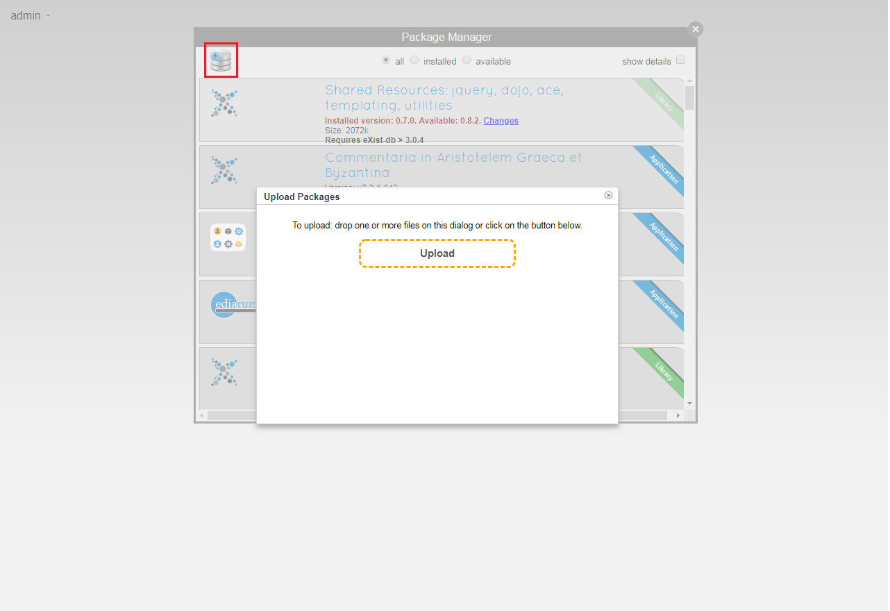

# quoteSalute Installation

1. Gehen Sie auf das [Github-Repository von quoteSalute](https://github.com/telota/dhd2019-exist-vue-workshop/workshopDHd/quoteSalute/releases) und speichern Sie die Datei `quoteSalute.db-[version].xar` lokal ab.
2. Öffnen Sie das eXist-db Menü (klick auf das Icon in der Symbolleiste) und klicken Sie auf "Open Dashboard". Ihr Standardbrowser (vorzugsweise Firefox oder Chrome) sollte sich nun öffnen und das eXist-db Dashboard anzeigen .
3. Geben Sie nun Ihre Admin-Nutzerdaten ein:
    * User: admin
    * Password: [Ihr Passwort, das Sie bei der Installation vergeben haben]
4. Öffnen Sie die Package Manager App. 
5. Klicken Sie auf den Button add a package, ziehen Sie die gespeicherte Datei quoteSalute.db-〈version〉.xar in das Fenster Upload Packages oder klicken Sie auf Upload und wählen die xar-Datei über Ihr Dateiexplorer aus und schließen Sie das Fenster Package Manager.

6. Im Dashboard sehen Sie nun die quoteSalute.DB App.

## Weitere Informationen

* [Java-Downloads für alle Betriebssysteme](https://www.java.com/de/download/manual.jsp)
* [eXist-db Basic Installation](https://exist-db.org/exist/apps/doc/basic-installation)
* [eXist-db Troubleshooting](https://exist-db.org/exist/apps/doc/troubleshooting.xml)
