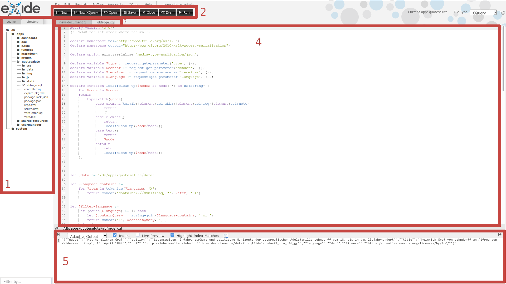

# Erste Schritte mit eXide

In diesem Abschnitt wird erklärt, wie man mit der eXist-db internen IDE (Integrated Development Environment; dt. Entwicklungsumgebung) Dateien innerhalb eines eXist-db-Projekts bearbeitet.

## Wichtige URLs

Bei einer lokalen Standardinstallation sollten Sie die folgenden Teilbereiche der Applikation unter folgenden URLs erreichen:

* eXist-Dashboard - [http://localhost:8080/exist/apps/dashboard/index.html](http://localhost:8080/exist/apps/dashboard/index.html)
* eXide - [http://localhost:8080/exist/apps/eXide/index.html](http://localhost:8080/exist/apps/eXide/index.html)
* quoteSalute - [http://localhost:8080/exist/apps/quoteSalute/salute.html](http://localhost:8080/exist/apps/quoteSalute/salute.html)

## eXide Starten

1. Gehen Sie auf das [eXist-db Dashboard](#Wichtige-URLs).
2. Klicken Sie auf **eXide**.
3. Es sollte sich nun ein neuer Browsertab mit [eXide](#Wichtige-URLs) öffnen.

## Aufbau von eXide

1. Dateibrowser (directory) - Hier können Sie die Dateien in der eXist-db browsen und mit Doppelklick öffnen.
2. Toolbar - Die meisten Buttons sind selbsterklärend.
  a. Eval-Button - Führt ein geöffnetes `.xql`-Skript aus.
  b. Run-Button - Startet die geöffnete App.
3. Datei-Tabs - Navigation zwischen den von Ihnen geöffneten Dateien.
4. Editor-Bereich - Hier können Sie den Quellcode der Dateien bearbeiten.
5. Ergebnis-Bereich - Dieser Bereich öffnet sich, nachdem man auf `Eval` gedrückt hat. Hier werden die Ergebnisse angezeigt.

